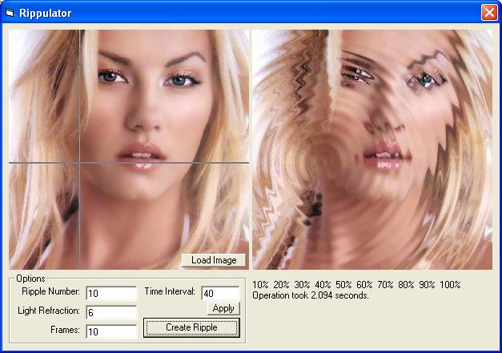



## A prog that draws and animated ripple on an image\. a good example of trigonometry\)\-

### Description

Uses basic Trig to draw ripples on an image. Its draws multiple frames that move outwards and the animates them to give the appearance of an image on a puddle
 
### More Info
 

             |
---                |---
**Submitted On**   |2004-10-20 17:19:14
**By**             |[Scott Buckley](https://github.com/Planet-Source-Code/PSCIndex/blob/master/ByAuthor/scott-buckley.md)
**Level**          |Intermediate
**User Rating**    |5.0 (10 globes from 2 users)
**Compatibility**  |VB 6\.0
**Category**       |[Graphics](https://github.com/Planet-Source-Code/PSCIndex/blob/master/ByCategory/graphics__1-46.md)
**World**          |[Visual Basic](https://github.com/Planet-Source-Code/PSCIndex/blob/master/ByWorld/visual-basic.md)
**Archive File**   |[A\_prog\_tha18126110312004\.zip](https://github.com/Planet-Source-Code/scott-buckley-a-prog-that-draws-and-animated-ripple-on-an-image-a-good-example-of-trigonom__1-57027/archive/master.zip)

### API Declarations

Get/SetDIBits

